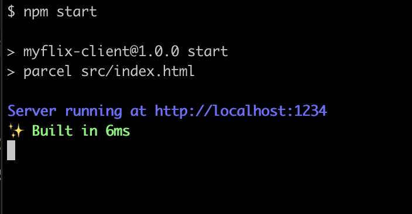

# myFlix-client

### Setup & Installation

- Open this code directory in your terminal and run
- `npm install`
- After this is completed then run `npm start` you should see a view like the screenshot below
  
- Copy the link(http://localhost:...) and paste in the browser to view the app.
